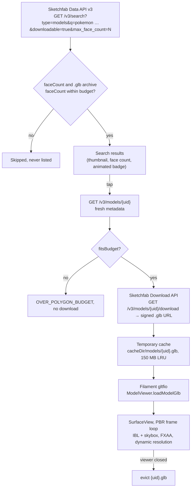

# FilamentPokemon

[](https://github.com/mmroberto100/FilamentPokemon/actions/workflows/ci.yml)

Android viewer for Pokémon 3D models. It searches [Sketchfab](https://sketchfab.com) for
downloadable Pokémon `.glb` models, filters them by a triangle budget that mobile GPUs can
handle, downloads the chosen model into the app's temporary cache and renders it with
[Google Filament](https://github.com/google/filament) (physically based rendering, image-based
lighting). Nothing is kept: the file is evicted when the viewer closes.

## How it works



Search adds the mandatory `pokemon` term to whatever you type, requests only downloadable
models sorted by likes (24 per page, cursor pagination), drops age-restricted entries and
anything without a `.glb` archive. The viewer re-fetches the model's metadata, applies the
budget gate, reuses a cached file or streams the download (progress shown), then hands the
file to Filament. Sketchfab download links expire after about five minutes, so they are
resolved fresh on every download and never stored.

## Triangle budget

Filament renders every triangle every frame. Past a few tens of thousands of triangles a
single character costs more than a 16 ms frame on mid-range Mali/Adreno GPUs, and the
vertex/index buffers plus textures of such a model can push a low-memory device into an
OOM kill. The budget keeps the app in the range where 60 FPS is realistic.

| Limit | Value | Where |
|---|---|---|
| Default face budget | 30 000 faces | `PolygonBudget.DEFAULT_MAX_FACES` |
| User range (budget sheet slider, 1 000-face steps) | 5 000 – 50 000 | `PolygonBudget.MIN_FACES` / `MAX_FACES` |
| `.glb` download cap | 64 MB | `PolygonBudget.MAX_GLB_BYTES` |
| Cache size | 150 MB, least recently used evicted first | `ModelCacheManager.DEFAULT_MAX_BYTES` |

The budget is persisted in DataStore (`max_face_count`) and enforced three times, so no
single check is trusted:

1. **Server side** – every search sends `max_face_count=<budget>`.
2. **Client side on results** – `PokemonModel.fitsBudget()` re-checks the scene `faceCount`
   *and* the `.glb` archive's own face count from the search payload; models that fail never
   reach the list.
3. **Viewer gate** – `ViewerViewModel` fetches fresh metadata for the tapped model and
   re-runs `fitsBudget()` against the current budget before any byte is downloaded
   (`DataError.Local.OVER_POLYGON_BUDGET`). The downloader additionally refuses archives above
   the 64 MB cap (`FILE_TOO_LARGE`).

## Requirements

- Android Studio with AGP 9.3 support (see the
  [AGP ↔ Studio compatibility table](https://developer.android.com/build/releases/gradle-plugin)).
- A JDK to launch the Gradle wrapper (9.5.0). The daemon itself runs on JDK 21, declared in
  `gradle/gradle-daemon-jvm.properties` and auto-provisioned by the foojay toolchain resolver
  if none is installed.
- Android SDK platform 37 (`compileSdk = 37`) and build-tools 36.0.0+. With licences accepted
  AGP downloads what is missing.
- A device or emulator on API 34+ (`minSdk = 34`) with a GPU that Filament can drive
  (OpenGL ES 3.0 or newer; an emulator with hardware graphics works).

## Sketchfab API token

Searching works anonymously. Downloading a model calls the Sketchfab Download API, which needs
a personal API token: on sketchfab.com open **Settings → Password & API** and copy the *API
token*. Put it in the git-ignored `local.properties` next to `sdk.dir`:

```properties
SKETCHFAB_API_TOKEN=xxxxxxxxxxxxxxxxxxxxxxxxxxxxxxxx
```

`app/build.gradle.kts` reads that key (falling back to the `SKETCHFAB_API_TOKEN` environment
variable) into `BuildConfig.SKETCHFAB_API_TOKEN` **for debug builds only**. Release builds
always embed an empty string, so a release APK can never leak the token. Without a token the
viewer reports "Sketchfab rejected the API token" when a download starts. The token is sent
only to `api.sketchfab.com`; thumbnails and the signed S3 model URLs go through a separate
unauthenticated client.

## Build, run, test

```sh
./gradlew :app:assembleDebug            # debug APK (token embedded if configured)
./gradlew :app:installDebug             # install on the connected device/emulator
./gradlew :app:assembleRelease          # R8-shrunk, unsigned release APK
./gradlew :app:testDebugUnitTest        # JVM unit tests (JUnit 5, Turbine, AssertK, Ktor MockEngine)
./gradlew :app:connectedDebugAndroidTest  # instrumented tests, needs an emulator or device

# Opt-in tests against the real Sketchfab API (skipped otherwise):
SKETCHFAB_LIVE=1 ./gradlew :app:testDebugUnitTest --tests '*Live*'
# …the live download test also needs a token:
SKETCHFAB_LIVE=1 SKETCHFAB_API_TOKEN=xxxx ./gradlew :app:testDebugUnitTest --tests '*Live*'
```

Unit tests use hand-written fakes (`Fake*` classes under `app/src/test`) rather than a mocking
library; HTTP is exercised through Ktor's `MockEngine` with recorded Sketchfab responses in
`app/src/test/resources/sketchfab`.

Release builds run R8 (`optimization { enable = true }` in `app/build.gradle.kts`): code and
resources are shrunk and obfuscated, project rules live in `app/proguard-rules.pro`, and the
retrace mapping is written to `app/build/outputs/mapping/release/mapping.txt`. No signing
config is checked in, so the output is `app-release-unsigned.apk`.

## Project layout

```
app/src/main/java/com/mmunoz/filamentpokemon/
├── FilamentPokemonApp.kt      Filament/gltfio/utils native init, Koin start, Coil loader
├── MainActivity.kt            edge-to-edge Compose host
├── core/
│   ├── domain/                PokemonModel, PolygonBudget, Result<D, E>, DataError, UserPreferences
│   ├── data/                  Ktor HttpClientFactory (HTTP/1.1 OkHttp engine), safeCall, DataStore prefs
│   └── presentation/          UiText, DataError → UiText mapping, ObserveAsEvents
├── search/
│   ├── domain/                SketchfabModelDataSource, SearchPage
│   ├── data/                  Sketchfab DTOs, mappers, KtorSketchfabModelDataSource
│   └── presentation/          SearchViewModel (State/Action/Event), screen, budget sheet, nav route
├── viewer/
│   ├── domain/                GlbDownloader, ModelCache, DownloadProgress, GlbHeader (glTF-Binary header check)
│   ├── data/                  KtorGlbDownloader (streamed .part → .glb), ModelCacheManager (cacheDir LRU)
│   ├── filament/              FilamentModelRenderer: Engine, ModelViewer, IBL/skybox, Choreographer loop
│   └── presentation/          ViewerViewModel, ViewerScreen, FilamentView (SurfaceView in Compose), nav route
├── di/AppModule.kt            Koin module: two HttpClients (authenticated / anonymous), data sources, ViewModels
├── navigation/AppNavHost.kt   type-safe NavHost wiring the search and viewer graphs
└── ui/theme/                  Material 3 theme
```

Conventions: MVI-style ViewModels (`State` / `Action` / `Event`), Koin for DI, typed errors via
`Result<D, E>` and `DataError` mapped to `UiText` in `core/presentation/util/DataErrorToUiText.kt`,
all network and file work on coroutines off the main thread. Filament resources are owned by
`FilamentModelRenderer`; `ModelViewer` destroys the `Engine` when the `SurfaceView` detaches,
and the renderer frees the IBL/skybox just before that.

## CI

`.github/workflows/ci.yml` runs on every pull request and on pushes to `develop` and `master`:
`./gradlew :app:testDebugUnitTest :app:assembleDebug :app:assembleRelease` on `ubuntu-latest`
with Temurin JDK 21 and the Gradle cache. There is no `local.properties` in CI, so `sdk.dir`
falls back to the runner's `ANDROID_HOME` and the token to an empty string; test reports are
uploaded as an artifact when the job fails.

## Branching

`develop` is the default branch. Work happens on `feature/step-N-<topic>` branches that are
merged into `develop` by pull request; `master` holds releases.

## Licences and attribution

- Models come from Sketchfab under Creative Commons licences. The viewer keeps an
  attribution card (author, licence, "View on Sketchfab") visible for as long as a model is on
  screen; respect each model's licence if you reuse anything.
- Pokémon is intellectual property of Nintendo, Creatures Inc. and Game Freak. This is a
  personal, non-commercial viewer and is not affiliated with them.
- `app/src/debug/assets/models/sample.glb` is the Khronos glTF-Sample-Assets "BoxTextured"
  model (CC-BY 4.0, © Cesium), bundled in debug builds only as a renderer smoke test.
- `app/src/main/assets/envs/default_env/*.ktx` (IBL and skybox) are the `default_env` sample
  environment from [google/filament](https://github.com/google/filament), Apache License 2.0.

## Known deviations from CLAUDE.md

- Filament is **1.75.1**, not the 1.76.1 named in `CLAUDE.md`: 1.76.1 was never published to
  Maven Central.
- Android only for now; the iOS target described in `CLAUDE.md` has not been started.
- Coil is pinned to **3.4.0**, the newest release built against the project's Kotlin 2.2.10 /
  AGP 9.3.2 baseline.
- `compileSdk` is **37** (target 36) because androidx.core 1.19, lifecycle 2.11 and
  navigation 2.10 require it.
- Requests to Sketchfab are pinned to HTTP/1.1: its AWS WAF answers OkHttp's HTTP/2 requests
  from Android with an empty `202` challenge.
